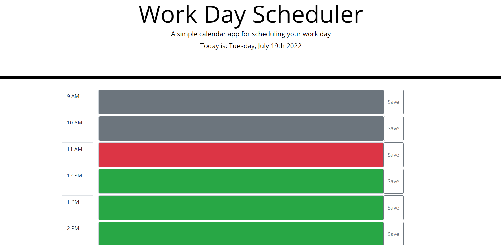

# 05-Challenge-Work-Day-Scheduler
## Description
This application is a simple work day scheduler that allows the user to input text into time slots to be saved for later. The time blocks are color coded to show past (gray), current (red), and future (green) time blocks. The user can click the save button for each time block to locally save their input for that specific time block.

## Sreenshots

## Links
[Deployed URl](https://tshadday.github.io/05-Challenge-Work-Day-Scheduler/
)

[Github Repository](https://github.com/tshadday/05-Challenge-Work-Day-Scheduler.git)